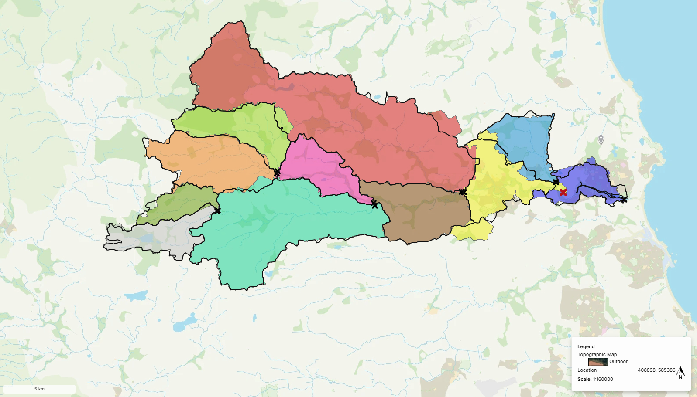

# Evaluating Nature-Based Flood Management Opportunities in the River Wansbeck

MEng Civil Engineering Dissertation exploring the use of NatureInsight® as a decision-support tool for catchment-scale Nature-based Solutions (NbS).

---

## Project Overview

This repository contains Google Colab notebooks, workflow documentation, and supporting outputs developed during my dissertation research at Newcastle University.

The project evaluates how digital decision-support tools can support flood risk management and the implementation of Nature-based Solutions (NbS) at a catchment scale.

Key themes explored include:

- Nature-based flood management
- Spatial suitability analysis
- Catchment-scale decision support
- Hydrograph assessment
- Trade-off evaluation
- NatureInsight® scenario testing
- Multi-criteria analysis (MCA)

---

## Catchment Overview

---
## Repository Structure

### 01_Data_Processing
Processing and extraction of NatureInsight® outputs, rainfall data and supporting datasets.

### 02_Scenario_Testing_and_Sensitivity_Analysis
Scenario testing workflows used to evaluate the influence of Suitability Score thresholds and intervention ranking.

### 03_Hydrograph_and_Flows_Analysis
Hydrological analysis including rainfall event extraction, hydrograph comparison and flood frequency assessment.

### 04_MATRIX_Key_Element_Of_this_Code
Trade-off analysis workflows, AHP weighting and development of the BRITE-NI decision-support concept.

### images
Example outputs, figures and visualisations used throughout the repository.

## Disclaimer and Acknowledgements

This repository was developed to support the dissertation *"Evaluating Nature-Based Flood Management Opportunities in the River Wansbeck Using NatureInsight® as a Decision-Support Tool".*

The workflows, scripts and notebooks were originally created for the River Wansbeck case study and have been subsequently refined to improve transparency and adaptability. While many components can be transferred to other studies, users should expect modifications to be required for different catchments, datasets and research objectives.

Results presented within this repository are specific to the assumptions, datasets and modelling decisions adopted during the study. Outputs may differ substantially when applied to alternative catchments or data sources and should therefore be interpreted within their local context.

NatureInsight® is a proprietary decision-support platform developed by Arup and SCALGO. Access to the platform requires an appropriate licence or subscription. This repository does not reproduce the platform itself, but instead demonstrates how selected outputs were processed, analysed and evaluated within an academic research setting.

Finally, recognition is due to the continued development of NatureInsight® by Arup and SCALGO. The platform enabled rapid catchment-scale assessment of Nature-Based Solutions and significantly accelerated analyses that would otherwise require extensive manual GIS processing and data integration.

Generative AI tools were used to assist with code documentation, workflow descriptions and repository presentation. All analyses, results, interpretations and conclusions were independently developed and verified by the author.